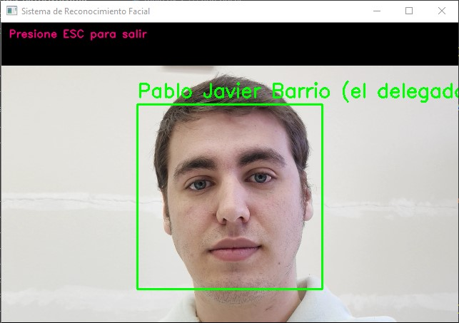
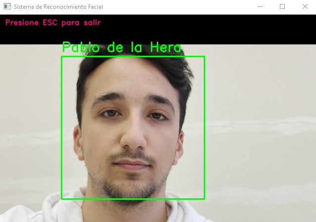
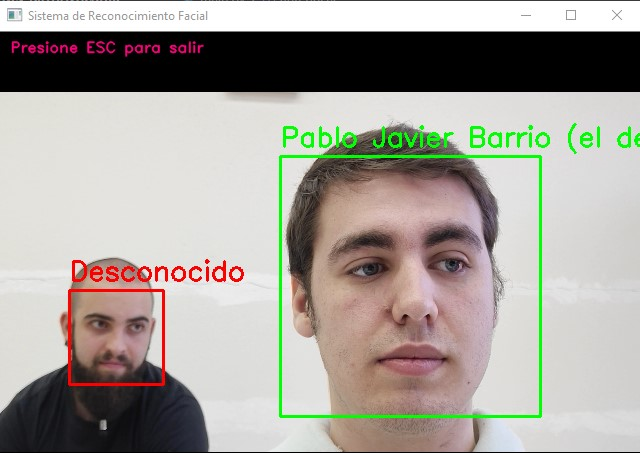
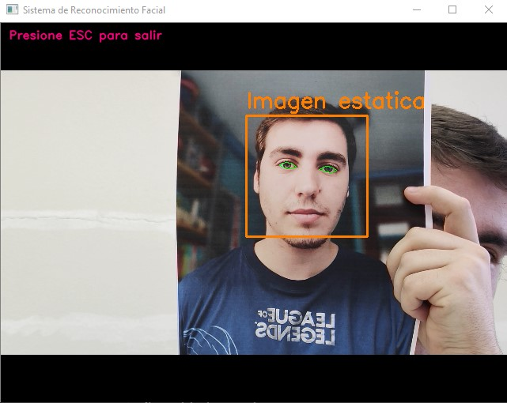

# Proyecto de Reconocimiento Facial

¡Bienvenido al proyecto de reconocimiento facial con OpenCV de la asignatura de Tecnologías de autenticación del máster universitario de investigación en Ciberseguridad de la Universidad de León! En este proyecto hemos desarrollado un sistema de reconocimiento fácil previamente entrenado con nuestros rostros, capaz de distinguir entre un usuario registrado y uno no registrado en nuestro sistema. 

## Funcionalidades

- El sistema puede identificar usuarios registrados y no registrados a través del reconocimiento facial.
- Cuando un usuario registrado es identificado correctamente, se mostrará su nombre y el cuadro identificador de su cara se pondrá de color verde.
- Si el sistema detecta un rostro que no está registrado, indicará que el usuario no está registrado y rodeará su rostro con un recuadro de color rojo.

## Tecnologías utilizadas

En este proyecto hemos utilizado las siguientes tecnologías:

- Python 🐍
- Biblioteca de reconocimiento facial (por ejemplo, OpenCV, dlib) 📷
- Algoritmos de aprendizaje automático (por ejemplo, redes neuronales convolucionales):robot:

## Instalación

Sigue estos pasos para instalar y ejecutar el proyecto en tu máquina local:

1. Clona este repositorio en tu máquina local.

``` git clone https://github.com/pbarrn00/OpenCV-Authenticator ```

2. Navega hasta el directorio del proyecto.

``` cd OpenCV-Authenticator ```

3. Instala las dependencias del proyecto.

###### Instalación con pip
``` pip install -r requirements.txt ```

###### Instalación con conda

``` conda install --file requirements.txt ```


4. Ejecuta la aplicación.

``` python main.py ```


## Uso

1. Asegúrate de tener una cámara web conectada a tu ordenador y que la variable video.capture() de la línea 10 del archivo main.py apunte a la cámara web que deseas utilizar por defecto, la cámara web 0
2. Inicia la aplicación ejecutando `python main.py`.
3. La aplicación comenzará a capturar imágenes desde la cámara y realizará el reconocimiento facial.
4. Si tu rostro está registrado, se mostrará tu nombre y el cuadro identificador se pondrá de color verde.
5. Si tu rostro no está registrado, se indicará que no estás registrado y se rodeará tu rostro con un recuadro de color rojo.

¡Diviértete utilizando nuestro sistema de reconocimiento facial! :smile: :camera: :bust_in_silhouette:

## Demostración






## Estructura de repositorio

```
│   📄main.py                                       # Script principal
│   📄main_detect_blink.py                        # Script para detectar parpadeos
│   📄main_detect_mvm.py                         # Script para detectar movimiento (pruebas)
│   📄main_eigenfaces.py                       # Script para entrenar el modelo de eigenfaces (pruebas)
│   📄main_fisher.py                           # Script para entrenar el modelo de fisherfaces (pruebas)
│   📄Práctica Final.pdf                     # Documento de la práctica
│   📄README.md
│   📄requirements.txt                      # Dependencias del proyecto
│   📄train_IA.py                         # Script para capturar frames de entrenamiento
│
├───📂clasificadores
│       📄haarcascade_eye.xml 
│       📄haarcascade_frontalface_default.xml   # clasificador de detección de rostros
│
├───📂demo
│       📸demo1.jpg
│       📸demo2.jpg
│       📸demo3.jpg
│       📸demo4.jpg
│
├───📂json
│       📄label_map.json                       # etiquetas de los usuarios
│
├───📂modelos
│       📄modelo_fisher.xml 
│       📄modelo_LBPHF.xml
│       📄modelo_LBPHF_advanced.xml
│
├───📂rostros                                   # Carpeta de almacenamiento de frames de entrenamiento
├───📂shape
│       📄shape_predictor_68_face_landmarks.dat   
│ 
├───📂usuarios_fisher                     # Imágenes de modelo fisher (pruebas)
│   ├───📂David Ondicol
│   ├───📂Pablo de la Hera
│   └───📂Pablo Javier Barrio (El delegado)
│
└───📂usuarios_registrados                # Imágenes de los usuarios registrados  
    ├───📂David Ondicol
    ├───📂Pablo de la Hera
    └───📂Pablo Javier Barrio (el delegado)
```

## Contribución

Si deseas contribuir a este proyecto, puedes seguir los pasos a continuación:

1. Haz un fork de este repositorio.
2. Crea una rama con la nueva característica: `git checkout -b nueva-caracteristica`.
3. Realiza los cambios necesarios y realiza los commits: `git commit -m 'Añade nueva característica'`.
4. Haz push a la rama: `git push origin nueva-caracteristica`.
5. Envía una pull request indicando las mejoras realizadas.

Agradecemos mucho tu contribución al proyecto. ¡Todas las ideas y sugerencias son bienvenidas!

## Colaboradores

 > Pablo Javier Barrio Navarro 
  Pablo De La Hera Martínez
  David Ondicol García

## Contacto

Si tienes alguna pregunta, sugerencia o problema, no dudes en contactarnos. Puedes enviar un correo electrónico a [pbarrn00@estudiantes.unileon.es](mailto:pbarrn00@estudiantes.unileon.es) o visitar nuestro sitio web [www.onkisko.com](https://onkisko.com).

¡Gracias por tu interés en nuestro proyecto! :+1: :robot: :camera:
